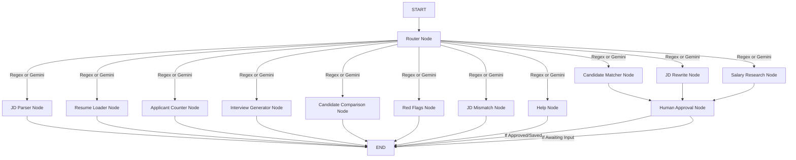

# HireFlow Agent - Agentic AI Recruitment Assistant

HireFlow Agent is a terminal-based conversational recruitment assistant designed for HR recruiters to manage hiring workflows with human-in-the-loop validation.

---

## Architecture Overview

The system is built on **LangGraph** as a central state machine. Rather than using a single giant monolithic agent, it divides tasks into specialized **Nodes** coordinated by a **Hybrid Router**.



---

## State Design

The shared state dictionary (`AgentState`) maintains conversation history, data parameters, vector matching output, external market data, and human control flags:

```python
class AgentState(TypedDict):
    user_query: str
    intent: str
    conversation_history: List[Dict[str, str]]
    next_node: str
    raw_jd: str
    role: str
    required_skills: List[str]
    experience_required: str
    location: str
    resumes_loaded: bool
    total_candidates: int
    matched_candidates: List[Dict[str, Any]]
    shortlisted_candidates: List[Dict[str, Any]]
    rewritten_jd: str
    interview_questions: Dict[str, List[str]]
    jd_feedback: str
    candidate_comparison: str
    red_flags: Dict[str, List[str]]
    salary_market_data: str
    company_salary_range: str
    skill_trends: List[str]
    confirmation_required: bool
    action_type: str
    recruiter_response: str
    response_message: str
```

---

## Node Details

1. **Router Node**: Uses regex checks for quick, rule-based matching (e.g. counting applicants, YES/NO responses) to minimize LLM usage. Falls back to Gemini structure classification when query intent is ambiguous.
2. **JD Parser Node**: Uses Gemini structured output to parse job descriptions into roles, required skills, location constraints, and experience requirements.
3. **Resume Loader Node**: Indexes the resumes directory using **ChromaDB** and `sentence-transformers/all-MiniLM-L6-v2` dense vectors.
4. **Applicant Counter Node**: Fast python node that counts resumes without invoking any LLMs.
5. **RAG Screening Node (Candidate Matcher)**: Retrieves candidates from ChromaDB, scores alignment, extracts matching and missing skills, and explains candidate suitability.
6. **JD Rewrite Node**: Rewrites job descriptions for specific tones (Startup, Friendly, Corporate) retaining requirement logic.
7. **Interview Question Node**: Generates tailored candidate guides (3 technical, 2 project, 1 behavioral question) using candidates' unique skills and backgrounds.
8. **Salary Research Node**: Uses Tavily web search to query market rates, displays findings, and prompts the recruiter to specify their company's salary budget.
9. **Human Approval Node**: Intercepts actions requiring approval (shortlists, JD updates, salary budgets). Resumes execution after the recruiter approves.
10. **Candidate Comparison**: Head-to-head analysis comparing strengths, weaknesses, and recommendation.
11. **Red Flags Detector**: Scans resume histories for gaps, short tenures, and timeline anomalies.
12. **JD Mismatch Analyzer**: Highlights mismatches between JD constraints (e.g. experience levels) and actual candidate pool availability.

---

## Setup & Running Guide

### 1. Configure Credentials
Duplicate `.env.example` as `.env` and enter your API keys:
```bash
GEMINI_API_KEY=AIzaSy...
TAVILY_API_KEY=tvly-...
```

### 2. Run the System
Start the terminal interface:
```bash
python main.py
```

### 3. Workflow Commands to Try
* `How many applicants?` - Checks local resumes (16 mock resumes are created and auto-indexed).
* `Find top candidates` - Screens candidates and matches them against the JD. Proposes Rahul Sharma and Emily Chen for shortlisting, asking for confirmation.
* `Rewrite JD for startup` - Generates a new JD draft and asks for approval before replacing the active JD.
* `What is the salary expectation?` - Researches market rate and prompts you to define your company budget (saves value to state).
* `Compare Rahul and Priya` - Runs a detailed comparison of strengths and weaknesses.
* `Show red flags for Rohan` - Analyzes timeline gaps (Rohan Gupta has a gap in 2024-2025).
* `Show JD candidate mismatch` - Evaluates if JD constraints align with the applicant pool.
* `Generate interview questions for Emily` - Generates customized candidate screening questions.
